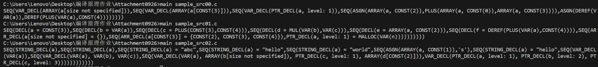

# CS2612 中期报告
## 带数组与字符串类型的程序语言的词法分析与语法分析
### 实现思路
为了完成该项目, 我们需要在Attachment0926的基础上添加功能. 具体来说, 主要是对$\texttt{lang.h, lang.c, lang.l, lang.y}$这四个文件进行完善, 以解析数组和字符串相关语法.
+ $\texttt{lang.l}$: 需要添加字符串, 单字符, 中括号, 逗号等词法分析;
+ $\texttt{lang.y}$: 需要添加数组的声明, 变量,数组声明同时初始化, 以及字符串类型, 还有单语句多变量声明等语句的语法分析;
+ $\texttt{lang.h}$: 需要完善相关结构体的定义, 以及新语句构造函数的声明;
+ $\texttt{lang.c}$: 需要完成$\texttt{lang.h}$中新声明函数的定义, 以支持语法解析.

### 目前成果
目前, 已经基本完成了这些新添加的$\texttt{expr, cmd}$的词法和语法分析, 成果如下所示:
+ 关于要求1, 测试集为$\texttt{sample\_src00.c}$:
```
var a[];
var a[3];
var *a;
a[2] = a[0] + a[3];
*a = *(a + 4)
```
解析结果如下:
```
SEQ(VAR_DECL(ARRAY(a[size not specified])),
SEQ(VAR_DECL(ARRAY(a[CONST(3)])),
SEQ(VAR_DECL(PTR_DECL(a, level: 1)),
SEQ(ASGN(ARRAY(a, CONST(2)),PLUS(ARRAY(a, CONST(0)),ARRAY(a, CONST(3)))),
ASGN(DEREF(VAR(a)),DEREF(PLUS(VAR(a),CONST(4))))))))
```
+ 关于要求2, 测试集为$\texttt{sample\_src01.c}$:
```
var a = 3;
var b = a;
var c = 3 + 4;
var d = b * c;
var e = a[2];
var f = *(a + 4);
var a[] = {};
var a[3] = {2, 3, 4};
var *a = malloc(n)
```
解析结果如下:
```
SEQ(DECL(a = CONST(3)),
SEQ(DECL(b = VAR(a)),
SEQ(DECL(c = PLUS(CONST(3),CONST(4))),
SEQ(DECL(d = MUL(VAR(b),VAR(c))),
SEQ(DECL(e = ARRAY(a, CONST(2))),
SEQ(DECL(f = DEREF(PLUS(VAR(a),CONST(4)))),
SEQ(ARR_DECL(a[size not specified] = {}),
SEQ(ARR_DECL(a[CONST(3)] = {CONST(2), CONST(3), CONST(4)}),
PTR_DECL(a, level: 1) = MALLOC(VAR(n))))))))))
```
+ 关于要求3, 测试集为$\texttt{sample\_src02.c}$:
```
char a[];
char a[3];
char a[3] = {'a', 'b', 'c'};
char a[5] = "hello";
char a[12] = "world";
a[1] = 's';
char a[] = "hello";
var a;
var a, b, c;
var a, b[], *c, d[2];
var *a, **b, ***c
```
解析结果如下:
```
SEQ(STRING_DECL(a),
SEQ(STRING_DECL(a),
SEQ(STRING_DECL(a) = "abc",
SEQ(STRING_DECL(a) = "hello",
SEQ(STRING_DECL(a) = "world",
SEQ(ASGN(ARRAY(a, CONST(1)),'s'),
SEQ(STRING_DECL(a) = "hello",
SEQ(VAR_DECL(VAR(a)),
SEQ(VAR_DECL(VAR(a), VAR(b), VAR(c)),
SEQ(VAR_DECL(VAR(a), ARRAY(b[size not specified]), PTR_DECL(c, level: 1), ARRAY(d[CONST(2)])),
VAR_DECL(PTR_DECL(a, level: 1), PTR_DECL(b, level: 2), PTR_DECL(c, level: 3))))))))))))
```
截图展示如下: 


### 接下来的工作
主要包括以下两方面:
+ 语法树的可视化
+ 解析功能的进一步完善.

### 解析工具版本
+ win_flex 2.6.4
+ bison (GNU Bison) 2.7
